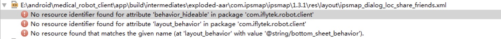
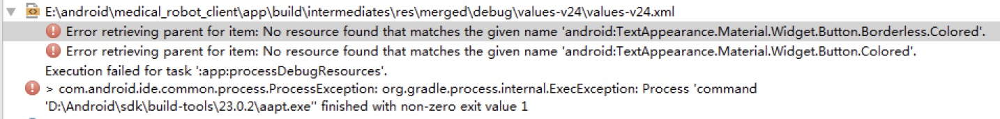
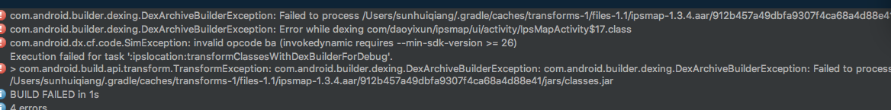

[](https://raw.githubusercontent.com/typ0520/fastdex/master/LICENSE)
[ ](https://bintray.com/xun/maven/com.ipsmap/_latestVersion)
[](https://android-arsenal.com/api?level=18)
[](http://ipsmap.com)

IpsmapSDK-Android 是一套基于 Android 4.3 及以上版本的室内地图应用程序开发接口，供开发者在自己的Android应用中加入室内地图相关的功能，包括：地图显示（多楼层、多栋楼）、室内导航、模拟导航、语音播报等功能。


## 添加依赖

```
在app.gradle 中配置如下 ,建议使用marven 方式 
// marven
compile ('com.ipsmap:ipsmap:1.4.5', {
        exclude group: 'com.android.support'
    })


```


## 目前支持的cpu 架构 arm,暂时不支持其他架构,请配置下面的cpu架构 ,去除其他类型的 CPU 类型,可以参考 app.gradle
```
在app.gradle 中配置如下 ,去除其他 CPU 类型

armeabi {
    versionCode defaultConfig.versionCode*10 + 1
    ndk {
        abiFilters = ["armeabi"]
    }
}

```


## 加入权限 如果编译的版本大于和等于 Android6.0,请使用动态权限申请 
```
在 manifest 中进行配置
<uses-permission android:name="android.permission.BLUETOOTH" />
<uses-permission android:name="android.permission.READ_PHONE_STATE" />
<uses-permission android:name="android.permission.INTERNET" />
<uses-permission android:name="android.permission.ACCESS_NETWORK_STATE" />
<uses-permission android:name="android.permission.CHANGE_WIFI_STATE" />
<uses-permission android:name="android.permission.WRITE_EXTERNAL_STORAGE" />
<uses-permission android:name="android.permission.WRITE_SETTINGS" />
<uses-permission android:name="android.permission.ACCESS_FINE_LOCATION"/>

```

## 使用
初始化

在Application 的onCreate 方法中进行初始化(特别注意,如果使用多进程比如推送服务,Application 的 onCreate 会被多次初始化,请初始化一次 SDK),在manifest 中进行声明 新的 Application

``` 
    使用默认配置信息
    IpsMapSDK.init(context, IPSMAP_APP_KEY);
    或
    定制配置信息 ,使用微信分享功能请实现相关的接口
    IpsMapSDK.init(new IpsMapSDK.Configuration.Builder(context)
                .appKey(Constants.IPSMAP_APP_KEY)
                .shareToWechatListener(this)
                 .debug(false)
                  //开启debug 后有log 日志,打正式版请务必关闭debug 日志
                  // 默认是false , 如果项目正式上线 debug 是false 
                  //以下情况: debug 只能是 true 如果是开发人员给出的测试 mapid(在正式版道一循上不显示,道一循Beta 版的列表显示)
                .build());


  微信分享功能可以参考以下代码,需要替换自己申请的id,需要实现ShareToWechatListener 接口

      @Override
      public void shareToWechat(String url, String title, String description, Bitmap bitmap) {
          try {
              IWXAPI wxApi = WXAPIFactory.createWXAPI(context, Constants.WECHAT_APP_ID);
              wxApi.registerApp(Constants.WECHAT_APP_ID);
              if (!wxApi.isWXAppInstalled()) {
                  T.showShort("未安装微信");
                  return;
              }
              WXWebpageObject webpage = new WXWebpageObject();
              webpage.webpageUrl = url;
              WXMediaMessage msg = new WXMediaMessage(webpage);
              msg.title = title;
              msg.description = description;
              msg.setThumbImage(bitmap);
              SendMessageToWX.Req req = new SendMessageToWX.Req();
              req.transaction = buildTransaction("webpage");
              req.message = msg;
              req.scene = SendMessageToWX.Req.WXSceneSession;
              wxApi.sendReq(req);
          } catch (Exception e) {
              e.printStackTrace();
          }
      }

                
```


如果主工程已经执行 cordova plugin add ./cordova-plugin-ipsmapSDK 下面的配置不用配置,插件会自动生成先关的代码 
```
在 src/xml/config 中添加插件的配置
<feature name="MapPlugin">
    <param name="android-package" value="com.daoyixun.ipsdemocordava.MapPlugin" />
</feature>

```


创建包名com.daoyixun.ipsdemocordava.MapPlugin 下的类 MapPlugin 
```
根据前端传递的参数进行修改 mapid 和 targetId

IpsMapSDK.openIpsMapActivity(this.cordova.getActivity(), map_id);
IpsMapSDK.openIpsMapActivity(Context context, String mapId, String targetId);

```

启动地图方式1,携带目的地和地图id,导航到目的地
```


IpsMapSDK.openIpsMapActivity(Context context, String mapId, String targetId);

```

启动地图方式2,仅仅传递地图的id
```
IpsMapSDK.openIpsMapActivity(Context context, String mapId);

```


## 混淆

```
-dontwarn com.baidu.**
-keep class com.baidu.** {*;}
-dontwarn com.iflytek.**
-keep class com.iflytek.**{*;}
-keep public class com.sails.engine.patterns.IconPatterns
```


## FAQ
1.0
< img alt="IpsmapSDK" src="/pic/7991511168017_.pic.jpg">
< img alt="IpsmapSDK" src="/pic/8021511168507_.pic.jpg">


出现上面的类似xml资源文件缺失的情况:
两种解决方案:
1. 在通过gradle 引用是加入exclude group: 'com.android.support' ,并且自己加入compile 'com.android.support:appcompat-v7:版本号'
建议方式.建议版本号25.3.1
2. 修改项目的support 支持和  compile 'com.android.support:appcompat-v7:25.3.1' 版本号一致

2.0 
```
app如果使用了okhttp ,glide ...出现第三发开源库 冲突
两种解决方案:
1.通过  exclude group: "com.squareup.okhttp3" 方式处理
然后保留项目的okhttp和glide 
2.保持和sdk的一致引入的第三方库版本号一致.否则有可能出现冲突
```
```
"glide"             : "com.github.bumptech.glide:glide:3.7.0",
"okhttp"            : "com.squareup.okhttp3:okhttp:3.8.0",
"gson"              : "com.google.code.gson:gson:2.8.2",
 ```        


 3.0
 
 < img alt="IpsmapSDK" src="/pic/AC0BDB3E-C313-4644-AB5F-F3C8FA209AEC.png.jpg">
 
 
```


    allprojects {
        repositories {
            jcenter()
            maven { url "https://jitpack.io" }
            flatDir {
                dirs 'libs'
            }
        }
    }
    
    compileOptions {
         sourceCompatibility JavaVersion.VERSION_1_8
         targetCompatibility JavaVersion.VERSION_1_8
     }
```


